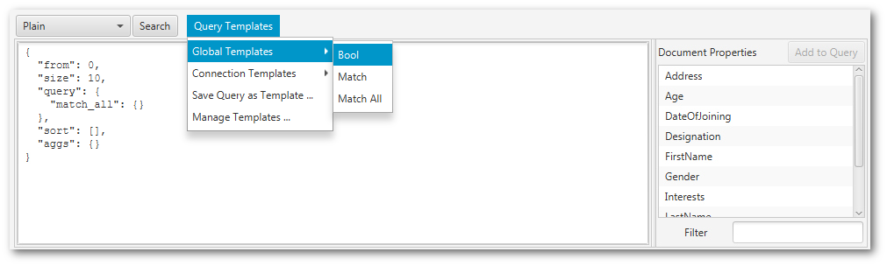
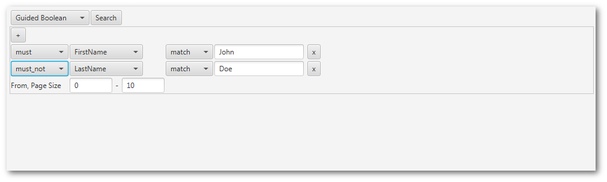
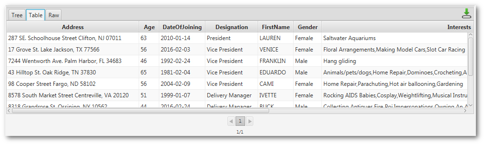

# Elasticsearch Inspector

"Elasticsearch Inspector" is a simple GUI for Elasticsearch, which itself does not provide one. The inspector is a cross-platform desktop application implemented with JavaFX and provides a number of convenient features to access and work with Elasticsearch clusters.

## Table of Contents

* [Running and Installation](#running-and-installation)
  * [From Source](#from-source)
  * [Pre-Build Releases](#pre-build-releases)
* [Features](#features)
  * [Connections, Indices, and Aliases](#connections--indices--and-aliases)
  * [Working with an Index or Alias](#working-with-an-index-or-alias)
    * [Details View](#details-view)
    * [Document View](#document-view)
    * [Query View](#query-view)
  * [Expert View](#expert-view)

## Running and Installation

### Requirements

The Elasticsearch Inspector requires Java 11. Java 11 is *not* bundled with the releases of the inspector. You can download it from [https://adoptopenjdk.net/](https://adoptopenjdk.net/).

### Running

To run the inspector execute the start script found in the "bin" directory in the inspector's installation directory.

### Installation from Source

To build the application from source you need [Gradle](https://gradle.org/). Clone the repository and switch to the desired tag. Then issue a simple `gradle clean build`. You will find the assembled distributions in the "build/distributions" folder. There's one for Windows, one for Linux, and one for MacOS.

### Installation from Pre-Build Releases

Download the desired package from the project's GitHub [releases](https://github.com/orm-fux/es-inspector/releases) page. Each release has a pre-build archive for each of the major platforms: Windows, Linux, and MacOS. Simply extract the archive to a convenient location and you're good to go. It is recommended that you download the [latest release](https://github.com/orm-fux/es-inspector/releases/latest).

## Features

### Connections, Indices, and Aliases

The inspector allows to save multiple connections to different Elasticsearch clusters - or to the same cluster, but with different credentials. For each connection you need to specify a name, URL to the Elasticsearch cluster, and the credentials to use. As credentials you can provide "none", basic username/password authentication, or API key authentication. The credentials are stored encrypted on your hard drive. Optionally you can define default filters that are applied to the listings of the aliases and indices of the connection. 

To open a connection click the  button or double click on the connection. When you "open" a connection the inspector looks up all the indices and aliases for it. If you've specified some default filters they are automatically applied to the list - allowing you to focus directly on only those indices and aliases that you need (your host might have a lot of indices/aliases and always work with only a few of them).

To close everything related to a connection you can use the  connection button. This will close all views in the inspector that are in some way related to the connection and clear the index and alias listing views.

The index and alias listing views have a small action bar that allow you to "open" them, create new ones, or delete them. When deleting an alias you are prompted to select for which alias you want to delete the index.

And as a side note: Each delete operation in the inspector will open a confirmation prompt to avoid accidental deletions.

### Working with an Index or Alias

To work with an index or alias select it in the listings on the left hand side of the inspector and double click it or use the corresponding "open" button. You can "open" an index/alias multiple times. 

When opening them a new tab is displayed in the main area of the inspector. The tab has three sub-tabs: "Details", "Document", and "Query". Initially it shows the "Details" sub-tab.

#### Details View

No matter if index or alias the details view shows the host URL, Elasticsearch version, and name.

For an index it shows the overall state as well: Status, number of documents, storage size. Further details include the mappings defined for the index as welll as a raw view of the index settings.

For an aliases viewer additional details are displayed. They are the indices for which an the alias is defined and which index is the "write index" for the alias (i.e. the index to which Elasticsearch writes for write operations on the alias).

#### Document View

To work with single documents you can use the document view. The view works on document ID basis and allows you to look up documents by their ID, delete a document, create a new one, or "change" (create or update) new documents. For the "change" operation the inspector will automatically look up the document and fill in the input field when you are entering the document ID.

#### Query View

This is the "search" view in the inspector. It has two main sub areas: one for the search query and another one for the search result.

##### Defining the Query

To enter queries you have the option to enter it like plain Elasticsearch JSON query or in an assisted manner. Select the option from the drop down in the top left corner of the view. 

When using plain queries for searching enter the query in the text field. ON the right hand side of the view you have a filterable listing of all mapped properties in the index (not available for aliases). You can select a mapped property in their and use the "Add to Query" button to add it at the current caret position in the query - or simply double click it. 

You can use the keyboard shortcut `Ctrl+F` to open a small search dialog to do some text searches in your query text. This keyboard shortcut is available for every "source code styled" text box in the inspector.

When using assisted queries (named "Guided Boolean" in the inspector) you are presented with a small UI that allows you to compose a relatively simple `bool` query. Select the properties and their values for `must`, `must_not`, and `should`. You can compose arbitrary many properties.

##### Search Results

The search results are displayed at the bottom of the query view. They are shown in three different styles: raw JSON, an expandable tree view, and a table view.

You can export the search results with the export button in the top right corner of the results view. You have the option to export them as JSON file or as CSV file. The CSV will export the data sorted as it is in the table view (but all data and not just the currently displayed page).

In the tree view you can copy a sub-tree by selecting it and using the keyboard shortcut `Ctrl+C`. It will be copied as JSON String.

The table view allows you to re-order the columns via drag-&-drop of the column headers, as well as sorting by column by clicking on the column headers.

### Expert View

If you know what you are doing you can open a "God Mode" view for each connection. You do so by using the little button with lightning bolt icon at the top of the connections list. It will show you a simple view that allows to call any REST API endpoint for that connection. You are free to define whatever call you want. *Be careful: Requests executed in this view do NOT synchronize with the other views showing information for this connection!*

